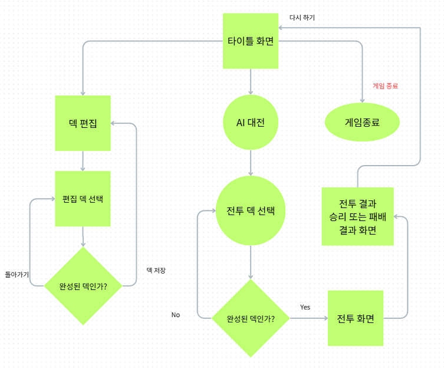
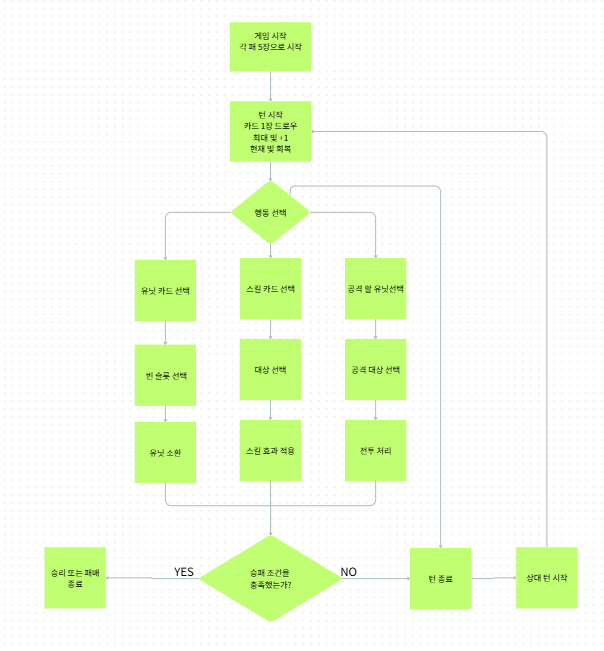

# Card Game

## 프로젝트 소개

플레이어가 직접 구성한 30장의 덱으로 점수 기반 AI와 대결하는 2D 턴제 카드 게임입니다.  
유닛과 스킬 카드를 사용하여 상대 영웅의 체력을 0 이하로 만들면 승리합니다.

## 개발 환경

- Unity 6000.3.6f1
- C#
- DOTween
- Damage Numbers Pro

## 주요 기능

- ScriptableObject 기반 카드 데이터 관리
- 30장 덱 편집 및 최대 9개 덱 관리
- JSON 기반 덱 저장과 불러오기
- 턴과 빛 자원 시스템
- 유닛 소환, 전투, 스킬 및 소환 효과
- 점수 기반 그리디 AI
- 이벤트 기반 AI 공격 후보 갱신
- 카드 미리보기와 전투 애니메이션

## 조작 방법

- 마우스 클릭: 카드, 필드 슬롯 및 공격 대상 선택
- 스페이스바: 손패 펼치기 및 접기
- ESC: 게임 메뉴 열기 및 닫기

## 프로젝트 구조

| 스크립트 | 역할 |
|---|---|
| `GameManager` | 게임 시작 및 종료 |
| `TurnManager` | 턴 진행 |
| `CardPlayManager` | 카드 선택과 사용 |
| `BattleManager` | 공격 및 전투 |
| `DeckEditorManager` | 덱 편집과 저장 |
| `SimpleAI` | AI 판단과 행동 |

## 트러블슈팅

- 카드와 공격 유닛이 동시에 선택되는 문제를 매니저 간 선택 상태 초기화로 해결했습니다.
- 공격 이동과 피격 흔들림의 충돌을 공격 상태 관리로 해결했습니다.

## 개선하고 싶은 점

- 카드와 효과 종류 확장
- AI의 다음 상황 예측
- 사운드와 전투 연출 보강
